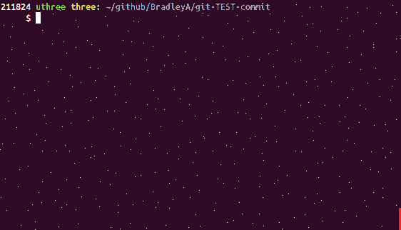

# git-TEST-commit-automation      

**In development** ...(8/2019 - 9/2019)

**In test** ...............(9/7/2019 - )
 
**WARNING**: These instructions are incomplete. Consider them as notes quickly drafted on a napkin rather than proper documentation!

#### Strategy:
Scripts to assist running something, and checking something, then reporting something; when you commit something. 

Continuous Integration and Continuous Delivery (CI/CD) requires Continuous Testing (CT) for DevOps teams to deliver fast quality solutions to customers.  Intergating CT automation into the development pipeline at every level reduces business risk and improves quality which keeps customers happy. 
  - If you are notified that there is an incident with your file when something was done with version 3.498.
     - It has been 1 minute or a two week sprint, which of these two scenarios would take less time to resolution.

#### Objectives:
1) Quick setup with default test cases for any Git repository (in seconds)
2) Quick uninstall on any Git repository (in seconds)
3) Quick check of test case depth for each file TESTed for any Git repository (in seconds) (option: all)
4) Quick reduction of untracked TEST case files (in seconds) (option: clean)

#### Future Objectives 

- Design for quick test case git branch merge (include steps)
- Quick upgrade of default test cases with test case code fixes (include steps, first test completed with setup-git-TEST-cases.sh)
- Quick test branch merge from test team's custom test cases without merge conflicts (include steps)
  - challenge is SA-setup.sh & FVT-setup.sh could be changed by development and test teams 
- Quick setup and configuration of FVT and SA test cases in \<REPOSITORY>/\<PATH>/TEST/\<COMMIT_FILE_NAME>/{FVT-setup.sh, SA-setup.sh, FVT-cleanup.sh, SA-cleanup.sh} (create-TEST-structure-for-git-file <git file> . . . )
- Quick backup of all test cases in repository (\<FILE-NAME>.tar) (code is currently in uninstall) (option: backup)
- Include support for custom test cases or intergration with other test or CI solutions 
- Support several types of files (support additional test case types (FVT,SA)
	
## Steps to evaluate git-TEST-commit-automation solution

**Start a new Git repository to test git-TEST-commit-automation solution**

    mkdir TEST-git-commit       #  Create a directory for a Git repository
    cd TEST-git-commit
    git init .                  #  Create an empty Git repository
    vi sample.sh                #  Write a shell script
    
         #!/bin/bash
         ###  sample.sh 
         echo "Hello World"
    
    chmod +x sample.sh
    git add sample.sh
    git commit -m 'initial commit' sample.sh

    
**Download and execute setup-git-TEST-cases.sh to setup git-TEST-commit-automation solution**

Objective 1) Quick setup with default test cases for any Git repository (in seconds)

    curl -L https://api.github.com/repos/BradleyA/git-TEST-commit-automation/tarball | tar -xzf - --wildcards BradleyA-git-TEST-commit-automation-*/hooks/bin/setup-git-TEST-cases.sh ; mv BradleyA-git-TEST-commit-automation-*/hooks/bin/setup-git-TEST-cases.sh . ; rm -r BradleyA-git-TEST-commit-automation-*/
    ./setup-git-TEST-cases.sh   #  setup git-TEST-commit-automation in hooks directory and .git/hooks directory
    rm setup-git-TEST-cases.sh  #  remove setup-git-TEST-cases.sh and setup is complete
    

    
**Configure two default test cases for sample.sh and execute them**   
    
    mkdir -p TEST/sample.sh     #  Create directories to trigger post-commit to search for test cases for sample.sh
    cp -p hooks/EXAMPLES/SA-setup.sh TEST/sample.sh  # copy the SA setup file which has two test case links uncommented
    git add TEST/sample.sh/SA-setup.sh  #  Include test case direcory and SA-setup.sh in Git repository
    git commit -m 'initial commit' 

You will notice that the 'git commit' command triggered a search for test cases and '...No test case directory found in TEST/sample.sh/TEST/SA-setup.sh' message.  After running 'git add TEST/sample.sh/SA-setup.sh' and 'git commit', Git hook, post-commit, searches for TEST/sample.sh/TEST/SA-setup.sh/ directory to test SA-setup.sh.  Since the directory was not found an INFOrmation massage was displayed.

**Make a change to sample.sh and run 'git add' and 'git commit'**
    
    vi sample.sh
    
         echo "First change"    #  add this line to end of sample.sh file
	 
    git add sample.sh
    git commit -m 'First change to sample.sh'

Two Static Analysis (SA) test cases were executed with one PASSing and the other ERRORing.  The message from the ERROR, '.../TEST-git-commit/TEST/sample.sh/SA-shellcheck-001.expected was not found.  Unable to compare shellcheck output.'  This test case requires a SA-shellcheck-001.expected file so the test case can compare the expected output to SA-shellcheck-001.test-case-output file.  Create an empty file because we want the expected output from shellcheck to be with no errors.

**Create an empty file, TEST/sample.sh/SA-shellcheck-001.expected**

    touch TEST/sample.sh/SA-shellcheck-001.expected  #  create empty SA-shellcheck-001.expected file
    git add TEST/sample.sh/SA-shellcheck-001.expected  #  Include test case .expected output file in Git repository
    git commit -m 'initial commit' 

**Make a change to sample.sh and run 'git add' and 'git commit'**
    
    vi sample.sh
    
         echo "Second change"    #  add this line to end of sample.sh file
	 
    git add sample.sh
    git commit -m 'Second change to sample.sh'    

Two test cases were run and two test cases have passed.  When you make changes to sample.sh and run Git commit, post-commit will search for test cases to run in TEST/sample.sh/ directory.  To add additional default SA- test case, edit TEST/sample.sh/SA-setup.sh file and remove the starting comment '#'.
  
## Create Custom Test Cases

Create a test case in directory, TEST/<FILE_TO_BE_TESTED>/, in the same direcory of the <FILE_TO_BE_TESTED>.  There are two locations to place your custom test case.  For test cases designed only for one file, use TEST/<FILE_TO_BE_TESTED>/ directory.  For test cases designed to be shared for more than one files use hooks/EXAMPLES/ directory and add a link (ln) to it in TEST/<FILE_TO_BE_TESTED>/SA-setup.sh.  Currently SA-* and FVT-* test cases are the only test cases supported by post-commit.

When creating a custom test case name it 'SA-<test-case-name-no-dot-001>' for Static Analysis (SA) or 'FVT-<test-case-name-no-dot-001>' for Funciotnal Verification Test.  For example a Functional Verification Test that tests if the option '--help' works is named FVT-option-help-001).

**Funciotnal Verification (FVT)** is defined as the process of verifying that the design meets its specification from a functional perspective. ... Functional verification establishes that the design under test (DUT) implements the functionality of the specification correctly.

**Static Analysis (SA)** is the examination of code prior to the program’s execution SA is code analysis, syntax, permission, code inspection, code review, etc.
	
Place the expected results from the test case into a file with the same test case name but add '.expected' ('dot'expected).  Pipe the output from the test case into a file with the same name but add '.test-case-output'. 

**Start editing from here:  These notes are cut and paste of information and make some since once I finsh design**

## Setup Test Cases ??

First do this then 

    git clone https://github.com/BradleyA/git-TEST-commit-automation.git
 
 **execute setup-git-TEST-cases.sh in an existing Git repository already using git-TEST-commit-automation**
 
    cd ~/github/BradleyA/\<REPOSITORY>
    curl -L https://api.github.com/repos/BradleyA/git-TEST-commit-automation/tarball | tar -xzf - --wildcards BradleyA-git-TEST-commit-automation-*/hooks/bin/setup-git-TEST-cases.sh ; mv BradleyA-git-TEST-commit-automation-*/hooks/bin/setup-git-TEST-cases.sh . ; rm -r BradleyA-git-TEST-commit-automation-*/
    setup-git-TEST-cases.sh
      % Total    % Received % Xferd  Average Speed   Time    Time     Time  Current
                                     Dload  Upload   Total   Spent    Left  Speed
      0     0    0     0    0     0      0      0 --:--:-- --:--:-- --:--:--     0
    100  106k    0  106k    0     0  60836      0 --:--:--  0:00:01 --:--:--  222k

    git status
    On branch master
    Your branch is up-to-date with 'origin/master'.
    Changes not staged for commit:
      (use "git add <file>..." to update what will be committed)
      (use "git checkout -- <file>..." to discard changes in working directory)

            modified:   hooks/README.md

    Untracked files:
      (use "git add <file>..." to include in what will be committed)

            hooks/EXAMPLES/FVT-exit-code-error-0-001
            hooks/EXAMPLES/FVT-exit-code-error-1-001
            hooks/EXAMPLES/tmp-test-tar-files/name-that-file-txt
            hooks/SETUP_TEST_CASES.md

    no changes added to commit (use "git add" and/or "git commit -a")

https://help.github.com/en/articles/syncing-a-fork

## Do something else here

**setup an environment for all tests to be run, creating directories for output, setting environment variables ... include clean section to remove and unset environment variables**

Append the following lines into your test case:

# Memo:

    <COMMIT_FILE_NAME>.test-case-input - Add support
  
    <REPOSITORY>/<PATH>/TEST/<COMMIT_FILE_NAME>/
      FVT-setup.sh  - setting up 'Production standard 10.0 TESTing' test cases
      SA-setup.sh  - setting up 'Production standard 10.0 TESTing' test cases
      FVT-cleanup.sh - remove all directories, files, links, ENVIRONMENT variables, <TEST_CASE_NAME>.test-case-output,etc for test cases
      SA-cleanup.sh - remove all directories, files, links, ENVIRONMENT variables, <TEST_CASE_NAME>.test-case-output, etc for test cases
      <TEST_CASE_NAME>.expected - expected output, error, etc
      <TEST_CASE_NAME>.test-case-output - output produced from test case
      <TEST_CASE_NAME>.test-case-input - input (. . text, directories, files, etc . . .)

#### Quick setup to test this solution
- fork or clone
- edit test script to test
- create TEST/\<COMMIT_FILE_NAME>/ directory
- copy hooks/EXAMPLES/SA-setup.sh TEST/\<COMMIT_FILE_NAME>/SA-setup.sh  

#### Setup for continued reuse

#### Steps for submitting additional test cases and code changes use pull requests

Note: 
edit  all SA-setup.sh:

    find ./hooks/ -type f -name SA-setup.sh -exec vi {} \;

Note:  

     $ git status
    On branch master
    Your branch is up-to-date with 'origin/master'.
    Untracked files:
      (use "git add <file>..." to include in what will be committed)

	hooks/

Nothing added to commit after adding hooks but untracked files present (use "git add" to track)

     $ ls -al
    total 32
    drwxrwxr-x 5 uadmin uadmin 4096 Sep  2 14:37 .
    drwxrwxrwt 9 root   root   4096 Sep  2 14:52 ..
    -rwxrwxr-x 1 uadmin uadmin 1606 Sep  2 14:36 dmonitor
    drwxrwxr-x 8 uadmin uadmin 4096 Sep  2 14:52 .git
    drwxrwxr-x 5 uadmin uadmin 4096 Sep  2 13:40 **hooks**
    drwxrwxr-x 2 uadmin uadmin 4096 Sep  2 14:36 images
    -rw-rw-r-- 1 uadmin uadmin 1070 Sep  2 14:36 LICENSE
    -rw-rw-r-- 1 uadmin uadmin 4038 Sep  2 14:36 README.md
 
     $ **mkdir -p TEST/dmonitor**
    
     $ cp hooks/EXAMPLES/SA-setup.sh TEST/dmonitor

====>>>  Moved from above

    git commit -m 'latest changes' <COMMIT_FILE_NAME>

After entering the above command, Git runs any Git hooks found in \<REPOSITORY-NAME>/.git/hooks/ directory.  Git hooks are scripts that Git executes before and/or after events. Two local Git hooks are included with git-TEST-commit-automation. 

- hooks/pre-commit  - Creates \<REPOSITORY>/hooks/COMMIT_FILE_LIST with a list of \<REPOSITORY-PATH>/\<FILE> being committed
- hooks/post-commit - Run production standard TESTing  

     **Production standard TESTing** - run test cases for files found in \<REPOSITORY>/hooks/COMMIT_FILE_LIST
  - Loop through committed files found in COMMIT_FILE_LIST
  - Check if COMMIT_FILE has a 'TEST' directory
  - Create links to EXAMPLES/\<TEST_CASE> and \<TEST_CASE>.expected and other test case files (FVT-setup.sh, SA-setup.sh)
  - Create list of test cases found in \<REPOSITORY>/\<PATH>/TEST/\<COMMIT_FILE_NAME>/ directory (files starting with SA-, FVT-)
  - Loop through \<REPOSITORY>/\<PATH>/TEST/\<COMMIT_FILE_NAME>/SA-<TEST_CASE>
    - Run \<REPOSITORY>/\<PATH>/TEST/\<COMMIT_FILE_NAME>/SA-<TEST_CASE>
  - Loop through \<REPOSITORY>/\<PATH>/TEST/\<COMMIT_FILE_NAME>/FVT-<TEST_CASE>
    - Run \<REPOSITORY>/\<PATH>/TEST/\<COMMIT_FILE_NAME>/FVT-<TEST_CASE>
  
**PASS** or **FAIL** or **ERROR**, some methed will notify someone of the results. (not sure which method is going to work for me and you? . . . stdout, logs-scrape, tables, email, twitter, slack, tall a friand, etc.)
 
**hooks directory**  The hooks directory was created because I wanted to modify the GitHub hooks and track changes per repository.  Include hooks/ in repostory because .git/hooks is not pushed and hooks change and these changes need to be tracked in a Git repository. (need to retest)
**Note**   I found out about hooks and need to remember and add to the README why I added a hooks directory in the repository so the hooks can be managed by the repository . . .Hooks are per-repository and are not designed to be pushed but can be pushed. Similarly, the repo config isn't pushed either, nor is anything in .git/info , or a number of other things. Pushing and pulling only exchanges branches/tags and commit objects (and anything reachable from a commit, e.g. trees, blobs** Add something about creating a symbolic link from ../.git/hooks to this hooks directory that are managed in this repository using markit. 

====>>>

[BradleyA/git-TEST-commit-automation] hooks/bin/setup-git-TEST-cases.sh - setup git TEST cases in current repository (#2)
after setup-git-TEST-cases.sh is run some additions steps are needed

git add hooks - if you want to include the tools in your repository remembering you can always upgrade to a later level without losing custom scripts or remove it

git add hooks
git commit -m 'install git-TEST-commit-automation'

====>>>

You can turn a folder within a Git repository into a brand new repository.    **find that doc I printed to complete this section

add branch marge what ever 
