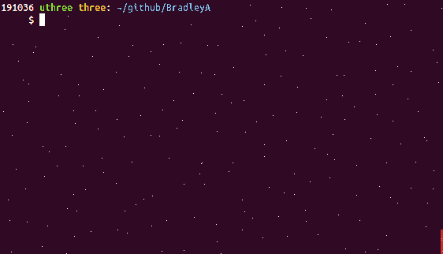
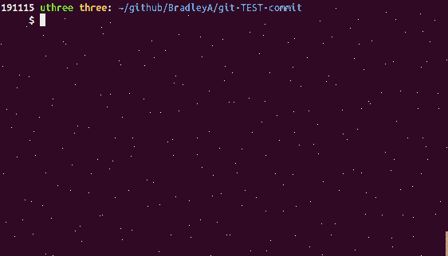

## Steps to evaluate git-TEST-commit-automation solution

**Start a new Git repository to test git-TEST-commit-automation solution**

    mkdir TEST-git-commit       #  Create a directory for a Git repository
    cd TEST-git-commit
    git init .                  #  Create an empty Git repository
    vi sample.sh                #  Write a shell script
    
         #!/bin/bash
         ###  sample.sh 
         echo "Hello World"
    
    chmod 775 sample.sh
    git add sample.sh
    git commit -m 'initial commit' sample.sh

    
**Download and execute setup-git-TEST-cases.sh to setup git-TEST-commit-automation solution**
This will download git-TEST-commit-automation files into a Git repository top directoy named hooks.  It will create two symbolic links for .git/hooks/pre-commit and .git/hooks/post-commit to hooks/pre-commit and hooks/post-commit.  It will also copy three files, list-git-TEST-cases.sh, setup-git-TEST-cases.sh and uninstall-git-TEST-cases.sh to /usr/local/bin.

Objective 1) Quick setup with default test cases for any Git repository (in seconds)

    curl -L https://api.github.com/repos/BradleyA/git-TEST-commit-automation/tarball | tar -xzf - --wildcards BradleyA-git-TEST-commit-automation-*/hooks/bin/setup-git-TEST-cases.sh ; mv BradleyA-git-TEST-commit-automation-*/hooks/bin/setup-git-TEST-cases.sh . ; rm -r BradleyA-git-TEST-commit-automation-*/
    ./setup-git-TEST-cases.sh   #  setup git-TEST-commit-automation in hooks directory and .git/hooks directory
    rm setup-git-TEST-cases.sh  #  remove setup-git-TEST-cases.sh and setup is complete
    

    
**Configure two default test cases for sample.sh and execute them**   
    
    mkdir -p TEST/sample.sh     #  Create directories to trigger post-commit to search for test cases for sample.sh
    cp -p hooks/EXAMPLES/SA-setup.sh TEST/sample.sh  # copy the SA setup file which has two test case links uncommented
    git add TEST/sample.sh/SA-setup.sh  #  Include test case direcory and SA-setup.sh in Git repository
    git commit -m 'initial commit' 

You will notice that the 'git commit' command triggered a search for test cases and '...No test case directory found in TEST/sample.sh/TEST/SA-setup.sh' message.  After running 'git add TEST/sample.sh/SA-setup.sh' and 'git commit', Git hook, post-commit, searches for TEST/sample.sh/TEST/SA-setup.sh/ directory to test SA-setup.sh.  Since the directory was not found an INFOrmation massage was displayed.

**Make a change to sample.sh and run 'git add' and 'git commit'**
    
    vi sample.sh
    
         echo "First change"    #  add this line to end of sample.sh file
	 
    git add sample.sh
    git commit -m 'First change to sample.sh'

Two Static Analysis (SA) test cases were executed with one PASSing and the other ERRORing.  The message from the ERROR, '.../TEST-git-commit/TEST/sample.sh/SA-shellcheck-001.expected was not found.  Unable to compare shellcheck output.'  This test case requires a SA-shellcheck-001.expected file so the test case can compare the expected output to SA-shellcheck-001.test-case-output file.  Create an empty file because we want the expected output from shellcheck to be with no errors.

**Create an empty file, TEST/sample.sh/SA-shellcheck-001.expected**

    touch TEST/sample.sh/SA-shellcheck-001.expected  #  create empty SA-shellcheck-001.expected file
    git add TEST/sample.sh/SA-shellcheck-001.expected  #  Include test case .expected output file in Git repository
    git commit -m 'initial commit' 

**Make a change to sample.sh and run 'git add' and 'git commit'**
    
    vi sample.sh
    
         echo "Second change"    #  add this line to end of sample.sh file
	 
    git add sample.sh
    git commit -m 'Second change to sample.sh'    

Two test cases were run and two test cases have passed.  When you make changes to sample.sh and run Git commit, post-commit will search for test cases to run in TEST/sample.sh/ directory.  To add additional default SA- test case, edit TEST/sample.sh/SA-setup.sh file and remove the starting comment '#'.
  
