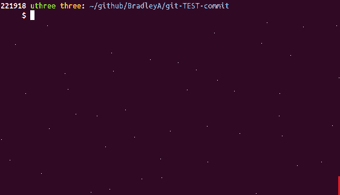

## Steps to check test case depth for a file
   
**Use --filename sample.sh to see the test cases for sample.sh**
    
    git-TEST-cases.sh --filename sample.sh
    INFO:  If file not found, check spelling or including --hooks option.
    ./sample.sh
    ./TEST/sample.sh
    ./TEST/sample.sh/SA-shellcheck-001.test-case-output
    ./TEST/sample.sh/SA-shellcheck-001
    ./TEST/sample.sh/SA-permission-775-001
    ./TEST/sample.sh/SA-cleanup.sh
    ./TEST/sample.sh/SA-setup.sh
    ./TEST/sample.sh/SA-shellcheck-001.expected

Two Static Analysis (SA) test cases were executed on sample.sh with both PASSing.  When you make changes to sample.sh and run Git commit, hook post-commit will search for test cases to run in TEST/sample.sh/ directory.

**That is it!**
