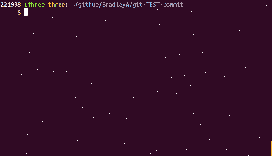

## Steps to setup default SA- test cases for a file
   
**Use '--filename test.sh --add' to add default SA- test cases for test.sh**
    
    cp sample.sh test.sh
    git add test.sh
    git-TEST-cases.sh --filename test.sh --add
    

Create Custom Test Cases

Create a test case in directory, TEST/<FILE_TO_BE_TESTED>/, in the same direcory of the <FILE_TO_BE_TESTED>. There are two locations to place your custom test case. For test cases designed only for one file, use TEST/<FILE_TO_BE_TESTED>/ directory. For test cases designed to be shared for more than one files use hooks/EXAMPLES/ directory and add a link (ln) to it in TEST/<FILE_TO_BE_TESTED>/SA-setup.sh. Currently SA-* and FVT-* test cases are the only test cases supported by post-commit.

**That is it!**
