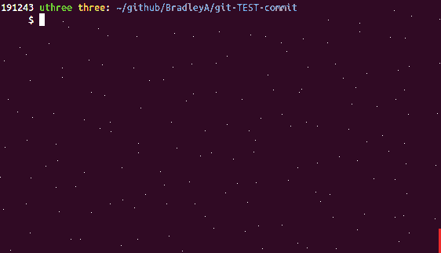

## Steps to evaluate git-TEST-commit-automation solution

**Start a new Git repository to test git-TEST-commit-automation solution**

    mkdir -p git-TEST-commit    #  Create a directory for a Git repository
    cd git-TEST-commit
    git init .                  #  Create an empty Git repository
    vi sample.sh                #  Write a shell script
    
         #!/bin/bash
         ###  sample.sh 
         echo "Hello World"
    
    chmod 775 sample.sh
    git add sample.sh
    git commit -m 'initial commit' sample.sh

    
**Download and execute setup-git-TEST-cases.sh to setup git-TEST-commit-automation solution**
This will download git-TEST-commit-automation files into a Git repository top directoy named **hooks**.  It will create two symbolic links for .git/hooks/pre-commit and .git/hooks/post-commit to hooks/pre-commit and hooks/post-commit.  It will also copy three files, git-TEST-cases.sh, setup-git-TEST-cases.sh and uninstall-git-TEST-cases.sh to /usr/local/bin.

Objective 1) Quick setup with default test cases for any Git repository (in seconds)

    curl -L https://api.github.com/repos/BradleyA/git-TEST-commit-automation/tarball | tar -xzf - --wildcards BradleyA-git-TEST-commit-automation-*/hooks/bin/setup-git-TEST-cases.sh ; mv BradleyA-git-TEST-commit-automation-*/hooks/bin/setup-git-TEST-cases.sh . ; rm -r BradleyA-git-TEST-commit-automation-*/
    ./setup-git-TEST-cases.sh   #  setup git-TEST-commit-automation in hooks directory and .git/hooks directory
    rm setup-git-TEST-cases.sh  #  remove setup-git-TEST-cases.sh and setup is complete
    

    
**Configure two default test cases for sample.sh and execute them**   
    
    mkdir -p TEST/sample.sh  #  Create directories to trigger post-commit hook to search for test cases in TEST/sample.sh for sample.sh
    cd TEST/sample.sh
    ln -s ../../hooks/EXAMPLES/SA-setup.sh .  #  Link EXAMPLES/SA-setup.sh file which has two test case links uncommented
    ln -s ../../hooks/EXAMPLES/SA-cleanup.sh .  #  Link EXAMPLES/SA-cleanup.sh
    git add SA-setup.sh SA-cleanup.sh  #  Include SA-setup.sh and SA-cleanup.sh as tracked files in Git repository
    git commit -m 'initial commit'
    cd ../..

After running 'git add SA-setup.sh SA-cleanup.sh' and 'git commit', Git hook, post-commit, triggered a search for test cases in TEST/sample.sh/TEST/SA-setup.sh/ and TEST/sample.sh/TEST/SA-cleanup.sh/ directories to test SA-setup.sh and SA-cleanup.sh.  Since the directories were not found two INFOrmation massages were displayed '...No test case directory found in TEST/sample.sh/TEST/SA-setup.sh'.  These messages can be ignored because SA-setup.sh and SA-cleanup.sh do have test directories in a different location, hooks/EXAMPLES/TEST/SA-setup.sh/ and hooks/EXAMPLES/TEST/SA-cleanup.sh/.  The reason we recieved these messages is because we committed two files which triggered hook post-commit to search for TEST directory relative to the file being commited.

**Make a change to sample.sh and run 'git add' and 'git commit'**
    
    vi sample.sh
    
         echo "First change"    #  add this line to end of sample.sh file
	 
    git add sample.sh
    git commit -m 'First change'

Two Static Analysis (SA) test cases were executed on sample.sh with both PASSing.  When you make changes to sample.sh and run Git commit, hook post-commit will search for test cases to run in TEST/sample.sh/ directory.

That is it!

To use different default SA- test case, remove the symbilic link (rm TEST/sample.sh/SA-setup.sh) and copy SA-setup.sh into the directory (cp -p hooks/EXAMPLES/SA-setup.sh TEST/sample.sh/).  Now you can edit SA-setup.sh with the test case needed for the command.  Once finished use git add and git commit to track TEST/sample.sh/SA-setup.sh changes.  
  
git-TEST-commit-automation runs when "git commit -m 'message' <filename>" is executed.  Post-commit searches in the same directory for a TEST/<filename>/ directory.  If found post-commit runs TEST/<filename>/SA-setup.sh and/or TEST/<filename>/FVT-setup.sh then searches for files beginning with SA- of FVT- and runs them.
