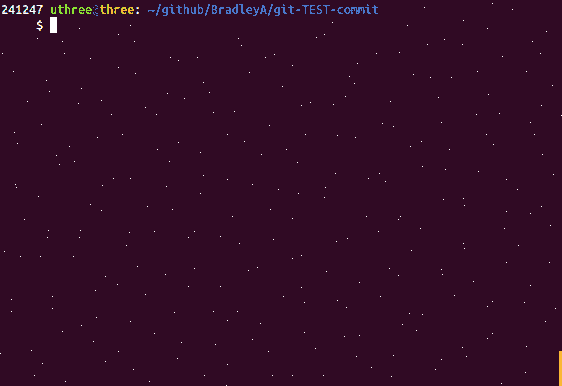

## Setup default SA- test cases for a new file
   
**Use '--filename test.sh --add' to add default SA- test cases for test.sh**
    
    cp sample.sh test.sh
    git add test.sh
    git-TEST-cases.sh --filename test.sh --add
    git-TEST-cases.sh -a
    

Two Static Analysis (SA) test cases were added to test.sh.  Entering git-TEST-cases.sh -a (--all) prints all the test case files.

**That is it!**

xxxx
