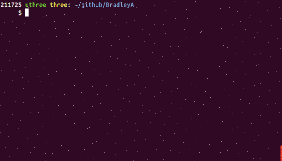

## Steps to uninstall git-TEST-commit-automation solution

**After completing: Steps to evaluate git-TEST-commit-automation solution**

    cd git-TEST-commit          #  Change directory into Git repository, git-TEST-commit
    uninstall-git-TEST-cases.sh    

    
**That is it!**
